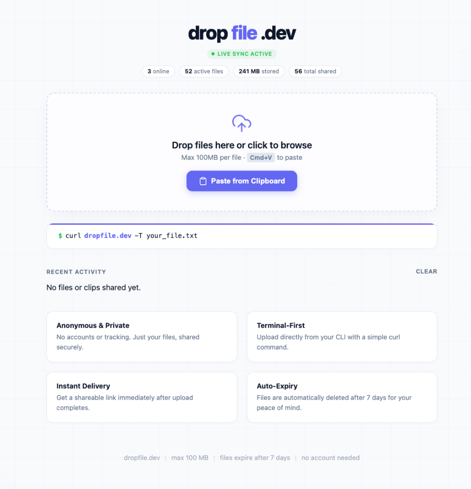

# dropfile.dev

Instant temporary file sharing and clipboard sync from your terminal or browser.  
Live Website: [https://dropfile.dev](https://dropfile.dev)



---

## Features

- **No Account Needed**: Anonymous, fast, and zero registration required.
- **Auto-Expiry**: Files automatically expire and are deleted after 7 days.
- **Terminal-First**: Upload directly from your command line using `curl`.
- **Real-Time Sync**: Instant live sync for devices on the same network / IP.
- **Clipboard & File Sharing**: Share text snippets or drop files directly from your browser.

---

## Privacy

- **IP-Localized Sync**: Discovery and real-time broadcasting are localized to your public IP.
- **Ephemeral Text**: Text clipboard snippets are held in memory and never persisted to the server's disk.
- **Zero Tracking**: No telemetry, analytics, or user profiling.

---

## Usage

### Browser
Visit [https://dropfile.dev](https://dropfile.dev) and drag & drop files, click to browse, or paste (<kbd>Cmd+V</kbd> / <kbd>Ctrl+V</kbd>) from your clipboard.

### Terminal (CLI)

**Upload a file:**
```bash
curl dropfile.dev -T yourfile.txt
```

**Download a file:**
```bash
curl -O dropfile.dev/ID/yourfile.txt
```

---

## Running Locally

Make sure you have [Go](https://go.dev) installed:

```bash
# Clone the repository
git clone https://github.com/papayaah/dropfile.git
cd dropfile

# Run development server
go run main.go
```

By default, the server runs on `http://localhost:8080` (or configure via `PORT=3001 go run main.go`).

---

## Deployment

1. Copy `.env.example` to `.env` and fill in your server details:
   ```bash
   cp .env.example .env
   ```
2. Run the deployment script:
   ```bash
   ./deploy.sh
   ```
